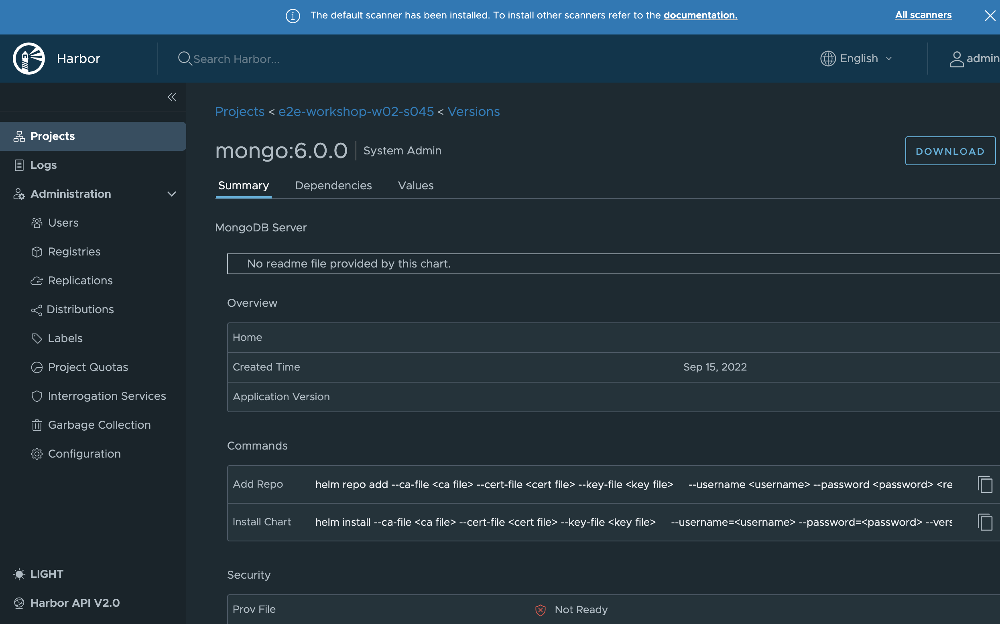
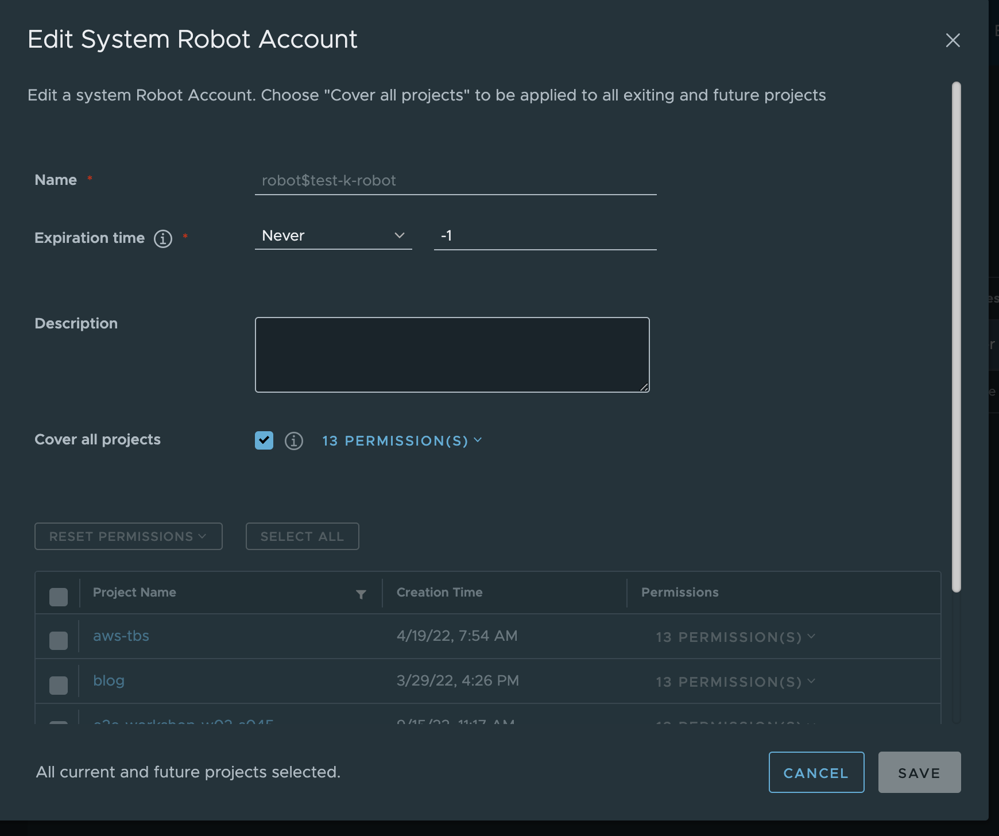
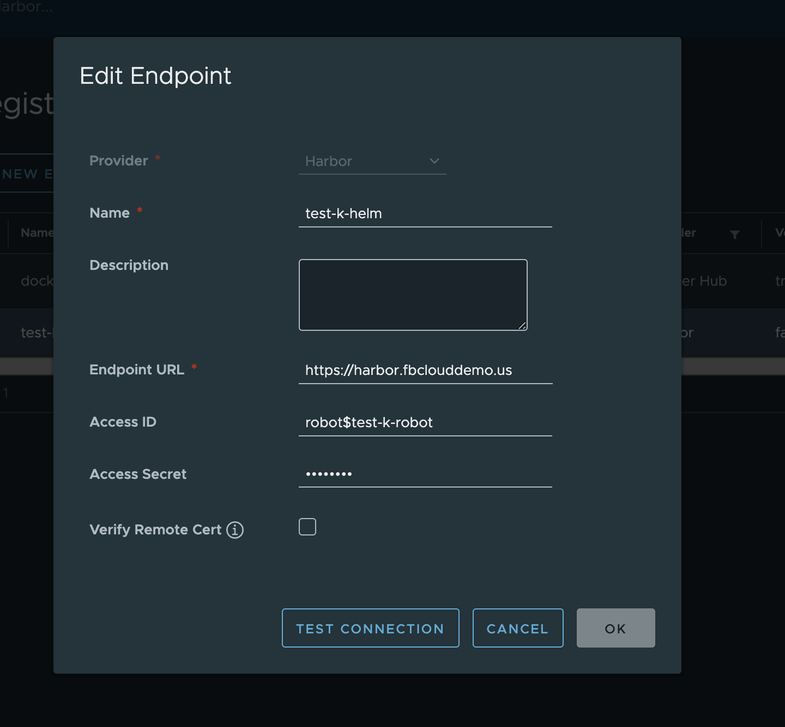
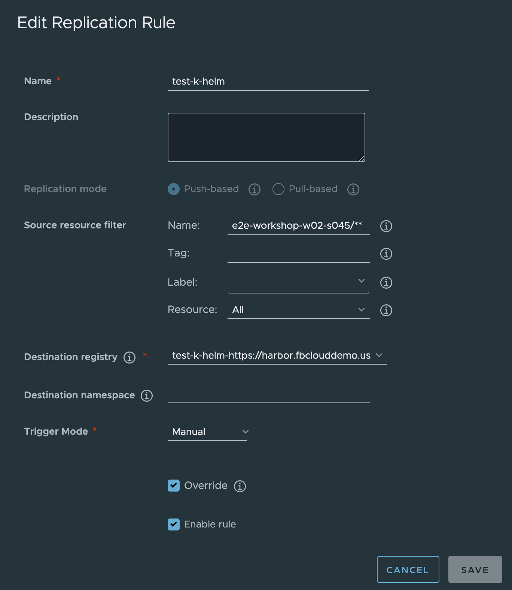
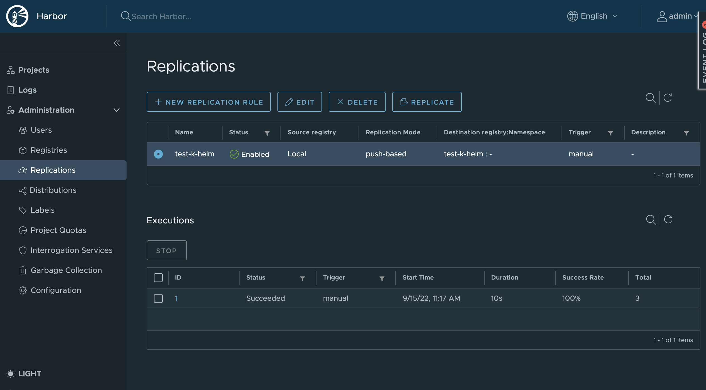
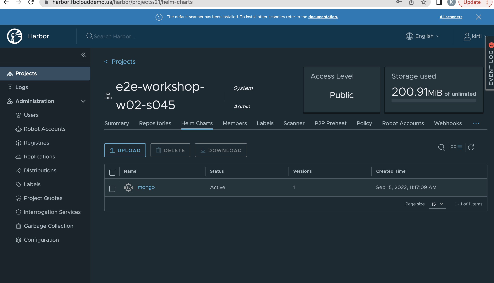

# Problem

I want to replicate helm charts from source harbor to destination harbor.

# Procedure

* Source harbor has a project and a mongo helm chart

* Mongo helm chart needs to be replicated to destination harbor onto same location

* Create Robot account on to <u>Destination</u> harbor.  Make sure you have right permissions set on this account

* Export robot account token JSON file from destination harbor and keep it ready.  

* Register new endpoint into source harbor repository using Registries->New Endpoint option

* Create a replication rule in the source harbor as shown below using Replication->New Repliction Rule.  Source repository filter is your helm chart project/**.
* Destination registry is the registry you have created in the above step

* Once the replication rule is created start the replication from source harbor to destination harbor.  You should see a progress and status of the replication

* Go to destination harbor and verify the project and helm charts are present

