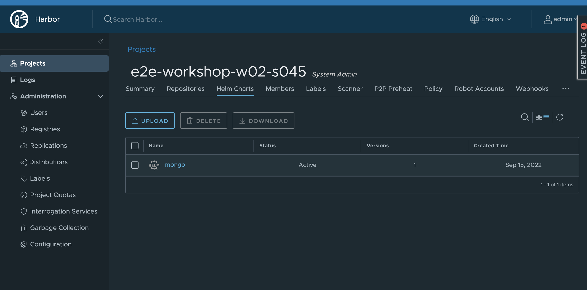

# Problem

I want to replicate helm charts from source harbor to destination harbor.

# Procedure

* Source harbor has a project and a mongo helm chart

* Mongo helm chart needs to be replicated to destination harbor onto same location

* Create Robot account on to <u>Destination</u> harbor.  Make sure you have right permissions set on this account

* Export robot account token JSON file from destination harbor and keep it ready.  

* Register new endpoint into source harbor repository using Registries->New Endpoint option

* 

